```mermaid
flowchart TD
    A([👤 Користувач надсилає питання]) --> B

    B{{"🔤 Визначення мови\n(перевіряємо символи ы ъ э = російська;\nі ї є ґ = українська)"}}
    B -->|Російська| C["🔄 Переклад на українську\nчерез Gemini\n(щоб пошук в українській базі\nпрацював точніше)"]
    B -->|Українська| D

    C --> D

    D["⚙️ ДВА ПРОЦЕСИ ПАРАЛЕЛЬНО\n(одночасно, щоб не гаяти час)"]

    D --> E["🔢 Перетворення питання у вектор\n(Vertex AI text-embedding-004)\n\nВектор = список ~768 чисел\nякі описують СЕНС питання.\nПохожі за змістом тексти\nмають схожі вектори."]

    D --> F["✍️ Переформулювання запиту\n(rewrite_model = gemini-2.5-flash)\n\nПриклад:\n'скільки добових за кордон'\n→ 'норми відшкодування добових витрат\nслужбове відрядження за кордон'\n\nПотрібно щоб юридичні документи,\nнаписані офіційною мовою,\nкраще знайшлись у пошуку."]

    E --> G
    F --> G

    G["🎯 Визначення теми питання\n(intent_model = gemini-2.5-flash)\n\nGemini читає питання і вирішує:\nяких категорій законів шукати.\nНапр: трудове, цивільне, фінансове...\n\nТакож враховується тариф:\nякі колекції юзеру взагалі доступні.\n\nРезультат: список з 15 колекцій\nзвужується до 3–7 найрелевантніших."]

    G --> H

    H["🔍 ПОШУК У БАЗІ ЗНАНЬ\n(Qdrant — база векторів)\n\nЯкщо є переформульований запит:\n  • Шукаємо за оригінальним вектором\n  • Шукаємо за вектором переформулювання\n  • Беремо кращий результат для кожного документа\nЯкщо переформулювання не вийшло:\n  • Шукаємо тільки за оригінальним вектором\n\nПоріг схожості: match_threshold_docs (0.4)\nДокументи нижче порогу — ігноруються.\nБереться max_docs × 5 кандидатів\n(більше ніж треба — для відбору далі)."]

    H --> I

    I{{"⚠️ Перевірка впевненості пошуку\nraw_gate_threshold = 0.42\n\nЧи схожість найкращого\nзнайденого документа < 0.42?"}}

    I -->|"Так — слабкий результат\n(питання нестандартне)"| J["🔎 Розширення пошуку\nДодаємо ще колекцій:\nрада_праця, рада_цивільне, кму,\nрада_фінанси, правові позиції ВС.\n\nПотім шукаємо знову\nв більшій кількості місць."]
    I -->|"Ні — нормальний результат"| K
    I -->|"Взагалі нічого не знайшли"| NORES(["❌ Відповідь: 'Не знайдено документів.\nСпробуйте переформулювати.'"])

    J --> K

    K["📊 КОРИГУВАННЯ ВАГИ ДЖЕРЕЛ\n(щоб важливіші джерела\nбули вище у списку)\n\n• laws_kmu: score × 1.18\n  → найвища практична цінність\n\n• rada_*: score × 1.12\n  → первинне законодавство\n\n• laws_positions / supreme / ccu: × 1.03\n  → судова практика\n\n• laws_zir: × 0.96\n  → роз'яснення ДПС\n\n• laws_wiki: × 0.90\n  → довідкові статті\n\n+ _DOC_TYPE_SCORE: Кодекс +0.08,\n  Закон +0.07, Постанова +0.06,\n  Лист −0.08"]

    K --> L["🗑️ Дедублікація\n(видалення повторів)\n\nОдин закон може мати десятки чанків.\nБеремо максимум 2 чанки\nз одного документа —\nщоб один закон не зайняв\nвсі місця у відповіді."]

    L --> M["🎲 Розподіл по категоріях\n(щоб була різноманітність джерел)\n\nКожна колекція отримує\ngguaranteed слоти у відповіді.\n\nCуд і правові позиції — обмежені\n(max 1/4 від загальної кількості),\nщоб не домінували.\n\nЗалишок — заповнюється найкращими\nз усіх категорій."]

    M --> N

    N["🔤 ПАРАЛЕЛЬНО: Пошук за ключовими словами\n(MatchText у Qdrant)\n\nНа відміну від векторного пошуку\n(шукає за ЗМІСТОМ),\nключовий пошук шукає\nбуквальний збіг СЛІВ у тексті.\n\nКорисно для:\n• Конкретних назв законів\n• Специфічних термінів\n• Документів де embedding\n  спрацював погано\n\nМорфологія (pymorphy3):\n'відрядженні' → 'відрядження'\nщоб знаходити всі форми слова.\n\nЗнайдені нові (яких не було\nу векторному пошуку) —\nдодаються до загального списку."]

    N --> O["🏷️ Буст по заголовку\n(Title boost)\n\nЯкщо слова з питання\nзнайдені у НАЗВІ документа —\nпіднімаємо його score вгору.\n\nНапр: питання 'добові КМУ' →\nПостанова КМУ 'Про добові витрати'\nотримує +0.12 до score."]

    O --> P{{"📋 Чи кандидатів\nбільше ніж max_docs?"}}

    P -->|"Так — треба відібрати\nнайкращі"| Q["🤖 LLM Реранкер\n(Gemini перечитує і обирає)\n\nGemini бачить список усіх\nкандидатів і питання,\nі вибирає які документи\nнайбільш корисні для відповіді.\n\nЗахищені слоти (точні збіги\nза назвою в KMU/позиціях ВС)\nзавжди виживають через реранкер."]
    P -->|"Ні — беремо всі"| R

    Q --> R

    R{{"🚦 Фінальна перевірка якості\nmin_relevance_score = 0.35\n\nЧи score найкращого документа\nбільше 0.35?"}}

    R -->|"Ні — занадто слабко"| LOWSCORE(["❌ Відповідь: 'У базі знань\nне знайдено відповіді.\nСпробуйте переформулювати.'"])
    R -->|"Так — є що показати"| S

    S["📝 Збірка контексту для Gemini\n\nПередається також:\n• Попередні повідомлення (до 12 / 6 turns)\n• context_summary — стислий переказ\n  старіших повідомлень (зберігається\n  у БД і оновлюється кожен 2-й turn)\n\nДокументи групуються в порядку:\n1. Закони Ради + wiki (max 15 чанків)\n2. Постанови КМУ (max 8 чанків)\n3. Суд: позиції ВС + КСУ + огляди (max 6)\n\nЗагальний ліміт: 80 000 символів.\n\nКожен документ має метадані:\nназва, дата, статус, флаги\n(воєнний стан, мораторій, зворотна дія)."]

    S --> T["⚙️ Формування інструкцій по тарифу\n\nЗалежно від плану юзера\nдодаються інструкції:\n• response_detailed → розгорнута відповідь\n• response_steps → розділ 'Що робити далі'\n• response_scenarios → альтернативні сценарії\n• response_vs_position → позиції Верховного суду\n\nЗалежно від впевненості пошуку:\n• Слабкий результат → 'перелич ВСЕ знайдене,\n  попередь про неточність, постав питання'\n• Середній → 'покажи що є, вкажи де шукати більше'\n• Сильний → повна відповідь з цитуванням"]

    T --> U["🚀 ДВА ВИКЛИКИ GEMINI ПАРАЛЕЛЬНО\n(щоб не чекати по черзі)"]

    U --> V["💬 Головний виклик:\nGemini генерує відповідь\n\nВхід:\n• Системний промпт (роль юриста)\n• Профіль юзера (роль, спеціалізація)\n• Знайдені документи з контекстом\n• Інструкції по тарифу і якості\n• Питання користувача\n• Історія чату\n\nВихід: структурована\nюридична відповідь з посиланнями [1][2][3]"]

    U --> W["🏷️ Паралельний виклик:\nКласифікація питання\n\nGemini визначає:\n• Категорія (трудове, цивільне...)\n• Складність (1–5)\n• Тип запиту (консультація, скарга...)\n• Настрій (нейтральний, тривожний...)\n\nЦе для аналітики і статистики."]

    V --> X
    W --> X

    X["🔗 Збагачення посилань\n\nДо кожного [N] в тексті\nдодаємо метадані:\n• Назва закону\n• Дата прийняття\n• URL на офіційний текст\n• Статус (діє / зупинено / воєнний стан)\n• Флаги: ⚠️ воєнний стан,\n  ⚠️ мораторій, ⚠️ зворотна дія"]

    X --> Y(["✅ Відповідь користувачу:\n• Текст відповіді\n• Список посилань з метаданими\n• Час обробки\n• Кількість використаних токенів\n• Категорія питання"])

    style A fill:#1a2744,color:#C9A84C,stroke:#C9A84C
    style Y fill:#1a3a1a,color:#4ade80,stroke:#4ade80
    style NORES fill:#3a1a1a,color:#f87171,stroke:#f87171
    style LOWSCORE fill:#3a1a1a,color:#f87171,stroke:#f87171
    style D fill:#1a2744,color:#C9A84C,stroke:#C9A84C
    style U fill:#1a2744,color:#C9A84C,stroke:#C9A84C
```

# Як працює URAI чат-бот — повна схема

> Схема базується на реальному коді `backend/server.py` (ендпоінти `/ask` і `/ask_stream`) та `app/chat/page.tsx`.
> Усі технічні терміни пояснено прямо в тексті.

---

---

## Скільки це займає часу

| Крок | Час |
|------|-----|
| Переклад RU→UA (якщо потрібен) | ~0.5с |
| Embedding + rewrite (паралельно) | ~1–2с |
| Intent classification | ~0.5с |
| Векторний пошук у Qdrant | ~0.2–0.5с |
| Keyword пошук | ~0.1с |
| LLM Reranker (якщо > max_docs) | ~1–2с |
| Генерація відповіді Gemini | ~3–15с |
| **Загалом** | **~5–20с** |

---

## Що впливає на якість відповіді

| Налаштування | Що робить | Де змінити |
|-------------|-----------|-----------|
| `match_threshold_docs` | Мін. схожість для включення документа в пошук | /admin/ai-settings |
| `raw_gate_threshold` | Коли вважати пошук "слабким" і розширювати | /admin/ai-settings |
| `min_relevance_score` | Мін. поріг щоб взагалі викликати Gemini | /admin/ai-settings |
| `rada_source_boost` | Буст для rada_* (1.12); kmu=1.18 фіксовано в коді | /admin/ai-settings |
| `max_output_tokens` | Максимальна довжина відповіді | /admin/ai-settings |
| `rewrite_examples` | Приклади переформулювань (few-shot) | /admin/ai-settings |
| `system_prompt` | Роль і поведінка AI | /admin/ai-settings |
| `max_docs` | Скільки документів отримує юзер | Тарифи (top_k) |

---

## Ліміти та збереження (фронтенд → БД)

Схема вище описує виключно **генерацію відповіді**. Паралельно фронтенд виконує:

1. **Перевірка ліміту** (до відправки запиту): `requests_this_month >= monthly_limit + bonus_requests` → блокує відправку.
2. **Збереження повідомлень**: обидва повідомлення (user + assistant) зберігаються в `messages` через `POST /api/chats/[id]/messages`.
3. **Лічильник**: після збереження assistant-повідомлення `requests_this_month++`. FREE план: лічильник без скидання. Платні: 30-денне вікно з `limit_reset_at`.
4. **Context summary**: кожен 2-й turn → `POST /api/chats/[id]/summarize` → стислий переказ всіх старих повідомлень зберігається в `chats.context_summary`.
5. **Назва чату**: після першого повідомлення → автогенерація через Gemini.

> Документ базується на реальному коді `backend/server.py`, `app/chat/page.tsx`, `app/api/ask/stream/route.ts`.  
> Оновлено: травень 2026.
