# URAI Chatbot Flow

> Updated: May 2026. Source of truth: `app/chat/page.tsx`,
> `app/api/ask/stream/route.ts`, `app/api/ask/route.ts`, `backend/server.py`,
> `backend/retrieval_helpers.py`, `backend/source_reranking.py`.

## Runtime Flow

```mermaid
flowchart TD
    A[User sends question] --> B[Chat UI creates chat if needed]
    B --> C[User message is saved]
    C --> D[Frontend sends last 6 messages as history]
    D --> E[Next.js ask route reads auth, profile, plan and features]
    E --> F[FastAPI /ask_stream]
    F --> G[Optional RU to UA search translation]
    G --> H[Follow-up resolver and compact history evidence carry]
    H --> I[Parallel: query embedding + AI query planner]
    I --> J[Planner and source features build allowed V2 collections]
    J --> K[Vector search: resolved question + planned search query]
    K --> L[Merge candidates]
    L --> M[Source scoring, avoid-topic penalties and dedup]
    M --> N[Document expansion, keyword search and title boost]
    N --> O[Primary-act discovery and article window protection]
    O --> P[Aspect and evidence-subquestion coverage]
    P --> Q[Deterministic answerability reranker]
    Q --> R[Source-role rerank by legal authority and intent]
    R --> S[Strict context squeeze and expired-document filter]
    S --> T[Gemini streamed answer + classification]
    T --> U[Completion marker / continuation if needed]
    U --> V[Frontend saves assistant message, citations, analytics]
```

## Frontend Payload

`app/chat/page.tsx`:

- sends the last 6 messages as `history`;
- currently sends `context_summary: null`;
- stores `context_summary` after background summarization, but does not inject it
  into the next generation payload yet;
- saves the assistant answer and citations after streaming completes;
- lets the user stop generation. While generation is active, the send icon
  becomes a stop icon; clicking it aborts the request and restores the last
  submitted question into the input;
- shows beta testers a one-time welcome modal after the first saved assistant
  answer. The modal explains beta status and asks the user to leave inline
  like/dislike feedback after answers. Closing it stores
  `urai_beta_tester_welcome_seen` in `localStorage`; automatic beta feedback
  modals are not opened after every answer.

## API Route

`app/api/ask/stream/route.ts` and `app/api/ask/route.ts`:

- verify Supabase auth;
- read `profiles` for tier, beta status, onboarding profile, personal prompt,
  response preferences and usage fields;
- treat beta users as effective Pro;
- read `subscription_plans.max_docs_retrieved`;
- read enabled `plan_features`;
- map source features to backend source keys;
- add `kmu`, `mod` and `zir` when at least one source feature exists;
- gate response preferences:
  - `full` requires Pro/Beta;
  - `detailed` requires paid/Beta;
- forward `question`, `max_docs`, `filter_sources`, `response_features`,
  `user_profile`, `history`, `context_summary`, `ai_personal_prompt`,
  `response_length_pref`, `response_lang_style`.

## Backend Retrieval

`backend/server.py::_ask_pipeline()` orchestrates chat retrieval and generation.
Most pure helper functions used by the pipeline now live in
`backend/retrieval_helpers.py`.

The pipeline:

1. Validate question.
2. Initialize Vertex AI if needed.
3. Translate Russian-looking questions to Ukrainian for search.
4. Resolve follow-up questions using recent history.
5. Build a compact history-evidence summary from cited previous assistant
   answers when the new question is a follow-up or recommendation continuation.
6. Run query embedding and the AI query planner in parallel.
7. Convert plan/source features into allowed V2 collections.
8. Apply planner `target_collections`, semantic collection hints and broad
   source preferences. If retrieval confidence is weak, widen safely back to
   allowed collections.
9. Run vector search for both the resolved question and distinct planned search
   query.
10. Merge by `(law_id, chunk_index)`.
11. Apply source/document scoring and avoid-topic penalties.
12. Deduplicate and diversify so one document/source family cannot eat the
    whole context.
13. Expand promising documents with sibling chunks.
14. Add keyword MatchText candidates using planner terms, aspects, evidence
    subquestions and carried history evidence.
15. Add title MatchText candidates.
16. Run dynamic primary-act discovery. This promotes only real retrieved
    candidates; it does not hardcode law ids.
17. Apply article-hint preference and contiguous article-window protection for
    direct norm/article questions.
18. Add aspect/evidence coverage candidates for multi-part questions.
19. Run deterministic answerability rerank.
20. Optionally run Gemini LLM reranker only when `llm_reranker_enabled=true`.
21. Run source-role reranking when `source_role_rerank_enabled=true`. This is a
    small policy-based ranking signal from `backend/source_reranking.py`; it
    uses source role and detected intent, not hardcoded answers.
22. Squeeze final context to the strongest chunks.
23. Filter cancelled/expired documents.
24. Build context buckets.
25. Generate streamed answer and parallel classification.
26. Ask the model to finish with hidden marker `URAI_DONE`.
27. If the answer is cut off or the marker is missing with a dangling ending,
    request a short continuation.
28. Strip the marker before returning/saving the answer.

## Beta Tester Feedback UX

Beta status has two effects:

- plan gating treats the user as effective Pro;
- the chat UI keeps inline `MessageFeedback` controls under assistant answers.

The current beta UX is intentionally non-intrusive. After the first assistant
answer is saved for a beta tester, the frontend displays
`BetaTesterWelcomeModal` once per browser. The modal does not collect feedback
itself; it explains that beta feedback should be left with the inline
like/dislike controls. The old behavior where a feedback modal auto-opened
after every assistant answer is no longer part of the current flow.

## Query Planner

The planner returns:

- `search_query`;
- `legal_terms`;
- `aspects`;
- `title_queries`;
- `title_must_terms`;
- `title_nice_terms`;
- `title_exclude_terms`;
- `primary_act_hints`;
- `source_preferences`;
- `target_collections`;
- `evidence_subquestions`;
- `should_compare`;
- `needs_clarification`;
- `clarification_questions`;
- optional `article_hint` and `article_confidence`.

Planner output is never legal truth. It is only a retrieval plan.

## V2 Collections

Production chat retrieval uses:

- `rada_finance_v2`
- `rada_state_v2`
- `rada_personnel_v2`
- `rada_court_v2`
- `rada_intl_v2`
- `rada_labor_v2`
- `rada_civil_v2`
- `rada_criminal_v2`
- `rada_admin_v2`
- `rada_housing_v2`
- `rada_land_v2`
- `rada_industry_v2`
- `rada_other_v2`
- `laws_supreme_v2`
- `laws_wiki_v2`
- `laws_ccu_v2`
- `laws_positions_v2`
- `laws_kmu_v2`
- `laws_mod_v2`
- `laws_zir_v2`

V2 uses `gemini-embedding-001`, 3072 dimensions and cosine distance.

## Context Squeeze

Search can be broad, but Gemini receives only the strongest final context:

| Preference | Target chunks |
| --- | ---: |
| `short` | 6 |
| `standard` | 8 |
| `detailed` | 10 |
| `full` | 12 |

Context is ranked by answerability, content coverage, source authority, recency
and text quality. Wiki/ZIR/court-like background sources are capped so they do
not dominate direct normative answers.

Overall cap: `context_char_cap`, default 30000 characters.

## Answer Completion Contract

Gemini is asked to end with hidden marker `URAI_DONE`.

Server behavior:

- if marker appears, stream buffering removes it before the user sees it;
- if answer ends in a dangling fragment or finish reason suggests truncation,
  `_complete_answer_if_needed()` asks for a short continuation;
- continuation is appended to the stream and saved answer;
- marker is stripped from `/ask`, `/ask_stream` final payload and saved message.

## Limits And Persistence

- Chat UI blocks users over `monthly_limit + bonus_requests`.
- Streaming API has free-account fingerprint protection.
- Usage increments only after assistant message save.
- Beta users bypass UI limit, use effective Pro features and do not receive the
  generic app-review modal after answers.

## Known Gaps

- `context_summary` is generated and stored but currently not sent into
  generation from the chat page.
- `tokens_used` is not a reliable real token count.
- Some legacy V1 scripts/pages remain for operations, but production chat should
  be reasoned about from V2 docs and code.
